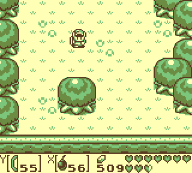

# Super Link's Awakening

`Super Link's Awakening` is a `Legend of Zelda: Link's Awakening` romhack that enables additional gameplay functionality by using `Super Game Boy` system functions.  This enables new gameplay features that have been designed to be played on an SNES.

## Play now
* Download the IPS patch from the latest [Release](https://github.com/cphartman/super-awakening/releases)
* Load the patched rom into the [Super Links Awakening Emulator.](https://cphartman.github.io/projects/super-links-awakening/)

## New Gameplay Features
* 🗡 Sword and Shield equipped to `A` / `B` buttons
* 💣 Items equipped to `X` / `Y` buttons 
* 🏹 Change items with `R` / `L` buttons
* 💼 Customizable item inventory
* 💨 Quick dash

### Expanded controls
Your sword and shield are equipped to `A` and `B`.  There are 2 different items equipped to `X` and `Y`.  The items currently equipped to `X` and `Y` are displayed on screen during gameplay.  

### Change Items
Use the shoulder buttons to change either equipped item.
* Press `L` to change the item in `Y`
* Press `R` to change the item in `X`
* Use `L+Y` or `R+X` to change to previous item

### Customizable item inventory
The pause menu allows you to customize your inventory.  Your inventory is used during gameplay to change between items.

You have 10 inventory slots.  Each inventory slot can have a different item.  An inventory slot can also be set to empty.  
* Press `Start` to open inventory menu
* Use `Arrow Keys` to select an inventory slot
* Press `R` or `L` to change item in the selected inventory slot

### Quick Dash
Double tap any direction to automatically start a dash.

## Technical Background
The `Super Game Boy` system exposes up to [4 controller inputs](https://gbdev.io/pandocs/Joypad_Input.html#usage-in-sgb-software) to `Game Boy` games.  This feature enables local multiplayer for `Game Boy` games.

| Street Fighter 2 | Bomberman |
| ---- | ---- |
|  |  |

The romhack takes advantage of this functionality by reading both `Super Game Boy` controllers inputs.  This double the number of buttons available to the game.  Custom functionality is implemented for the additional button inputs.

## Setup

* `Super Game Boy` compatible system
* Both `SGB Controllers` should both map to a single `IRL controller`.

### Controller Mapping

`IRL Controller` is the physical controller used to play the romhack.  `SGB Controller` is the controller input for the `Super Game Boy` system.

| IRL Controller  | SGB Controller | SGB Button |
| ------------- | ------------- | ------------- |
| `Up` | Player 1 |  `Up`  |
| `Down` | Player 1 |  `Down`  |
| `Left` | Player 1 |  `Left`  |
| `Right` | Player 1 |  `Right`  |
| `Start` | Player 1 |  `Start`  |
| `Select` | Player 1 |  `Select`  |
| `A` | Player 2 |  `Right`  |
| `B` | Player 2 |  `Down`  |
| `X` | Player 2 |  `Up`  |
| `Y` | Player 2 |  `Left`  |
| `R` | Player 2 |  `Start`  |
| `L` | Player 2 |  `Select`  |

*Diagram showing the `IRL Controller` with `SGB Controller` button mapping*

### Unused `Super Game Boy` controller buttons
The `A` and `B` buttons on both `SGB Controller 1` and `SGB Controller 2` are **not** used in the romhack.  Pressing `A` or `B` on either controller will have unexpected results in the games.

## System Compatibility
This romhack is fully supported on an original `Super Nintendo` system using a `Super Game Boy`.  Not all emulators support the required `Super Game Boy` functions for this romhack.  `Game Boy Color` compatibility is experimental for supported systems. 

| System | Compatibility  | Notes |
| ---- | ----  | ---- |
| Super Nintendo | ✅  | Use [Blueretro](https://github.com/darthcloud/BlueRetro) to map the `Src` controller to `Dest ID Output 2` |
| BGB | 🌈 | Set `Emulated System` to  `Super Gameboy`.  Map the required IRL controller/keyboard inputs to `joypad1`. `SGB+GCB` support is experimental. |
| Mesen | ✅  | Set `Gameboy` model to  `Super Game Boy`.  Map the required IRL controller/keyboard inputs to `SNES Port 2 Controller`. |
| EmulatorJS | ⚠️  | [Custom fork](https://github.com/cphartman/super-awakening-emulator) |
| mGBA | ❌  | Does not support controller 2 remapping |
| Retroarch | ❌  | Crashes with `mgba`, `mesen-s`, and `gambatte` cores |
| Analogue Pocket | ❌  | `Spiritualized.SuperGB` does not support controller 2 remapping |