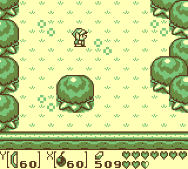

# Super Link's Awakening

`Super Link's Awakening` is a `Legend of Zelda: Link's Awakening` romhack that enables additional gameplay functionality by using `Super Game Boy` functions.  This enables new gameplay features that have been designed to be played with a `Super Nintendo` controller.

## Play now
* Download the IPS patch from the latest [Release](https://github.com/cphartman/super-awakening/releases)
* Load the patched rom into the [Super Links Awakening Emulator.](https://cphartman.github.io/projects/super-links-awakening/)

## New Gameplay Features
* 🗡 Sword and Shield equipped to `A` / `B` buttons
* 💣 Items equipped to `X` / `Y` buttons 
* 🏹 Change items with `R` / `L` buttons
* 💼 Customizable item inventory
* 💨 Quick dash
* 💪 Quick lift

### Expanded controls
Your sword and shield are equipped to `A` and `B`.  There are 2 different items equipped to `X` and `Y`.  The items currently equipped to `X` and `Y` are displayed on screen during gameplay.  

### Change Items
Use the shoulder buttons to change either equipped item.
* Press `L` to change the item in `Y`
* Press `R` to change the item in `X`
* Use `L+Y` or `R+X` to change to previous item

### Customizable item inventory
The pause menu allows you to customize your inventory.  Your inventory is used during gameplay to change between items.

You have 10 inventory slots.  Each inventory slot can have a different item.  An inventory slot can also be set to empty.  
* Press `Start` to open inventory menu
* Use `Arrow Keys` to select an inventory slot
* Press `R` or `L` to change item in the selected inventory slot

### Quick Dash
Double tap any direction to automatically start a dash.

### Quick Lift
Push against a heavy object and press `X` or `Y` to automatically lift the object.  Equip the `Power Bracelet` to lift other objects.

## Technical Background
The `Super Game Boy` system exposes up to [4 controller inputs](https://gbdev.io/pandocs/Joypad_Input.html#usage-in-sgb-software) for `Game Boy` games.  This feature enables local multiplayer for `Game Boy` games.

| Street Fighter 2 | Bomberman |
| ---- | ---- |
|  |  |

The `Super Game Boy` forwards button inputs from the `Super Nintendo` to button inputs on the `Game Boy`.  However, the `Game Boy` can only support 8 buttons per controller.  As a result, the additional `X`/`Y`/`R`/`L` buttons on the `Super Nintendo` controller are ignored.

The romhack takes advantage of this functionality by instructing the `Super Game Boy` to send the `X`/`Y`/`R`/`L` buttons from controller 1 to the `Up`/`Down`/`Left`/`Right` buttons for the `Game Boy` controller 2.  This allow a single controller from the `Super Nintendo` to send all 12 button inputs to the `Game Boy`.  The romhack implements custom functionality for the additional controller inputs.

## System Compatibility
This romhack is fully supported on an original `Super Nintendo` system using a `Super Game Boy`.  Not all emulators support the required `Super Game Boy` functions for this romhack.  `Game Boy Color` compatibility is experimental for supported systems. 

| System | Compatibility |
| ---- | ---- |
| Super Nintendo | ✅  |
| BGB | 🌈 |
| Mesen | ✅  |
| Analogue Pocket | ✅ |
| EmulatorJS | ⚠️  |
| mGBA | ❌  |
| Retroarch | ❌  |
